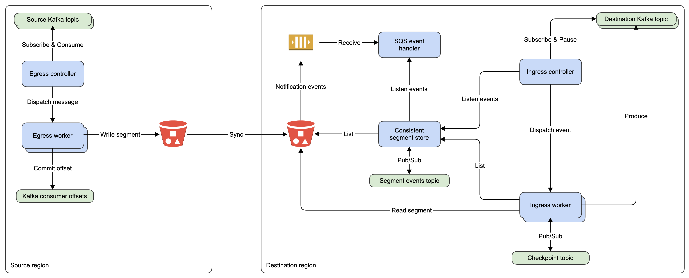

# kafka-replicator

Kafka replicator is a tool used to mirror and backup Kafka topics across regions.

## Features

- At-least-once message delivery ([details](pkg/ingress/config.go)).
- Message ordering guarantee per topic partition.
- Compaction of historical data.
- Per partition metrics to track data volume and replication lag.
- Plugable storage format, with [Apache Parquet](https://parquet.apache.org) the default implementation.
- Flexible configuration and replication topology.

## Limitations

- AWS S3 storage class parameter is not exposed atm. (TODO)
- Destination topic partition count is not adjusted automatically to match source topic partition count. (TODO)
- Destination topics are not created automatically and topic metadata is not replicated.
- Partition offset gaps are not explicitly tracked which can cause false lost segment warning messages during ingress operation. Gaps can occur during topic compaction for slow egress consumers and for scenarios involving transactional messages.

## Examples

The following samples show a simple setup where the source `sensor.events` Kafka topic is replicated from region `us-east-1` to destination topic `sensor.events.copy` in region `us-west-1` using Parquet storage format. Daily compaction for streaming segments is enabled to run in source region at 1:00 AM. Error handling is omitted for brevity.

#### Egress controller runs in AWS region `us-east-1`:

```golang
func startEgress(awsConfig *aws.Config, kafkaBrokers []string) {
	awsSession, _ := session.NewSession(awsConfig)

	parquet, _ := formats.NewS3Parquet(formats.S3ParquetConfig{
		AWSConfig: awsConfig,
		CreatedBy: "example_app",
	})

	controller, _ := replicator.NewEgress(replicator.EgressConfig{
		LocalRegion:   "us-east-1",
		AWSConfig:     awsConfig,
		AWSSession:    awsSession,
		S3Bucket:      "source-bucket",
		SegmentFormat: parquet,
		KafkaBrokers:  kafkaBrokers,
		KafkaTopics: map[string]*egress.TopicConfig{
			"sensor.events": {
				MaxSegmentMessages: 1000000,
				MaxSegmentSize:     100 * 1024 * 1024, // 100 MiB
				MaxSegmentAge:      5 * time.Minute,
			},
		},
	})

	controller.Start()
}
```

#### Ingress controller runs in AWS region `us-west-1`:

```golang
func startIngress(awsConfig *aws.Config, kafkaBrokers []string) {
	awsSession, _ := session.NewSession(awsConfig)

	parquet, _ := formats.NewS3Parquet(formats.S3ParquetConfig{
		AWSConfig: awsConfig,
	})

	source := ingress.Source{
		Region: "us-east-1",
		Topic:  "sensor.events",
	}

	controller, _ := replicator.NewIngress(replicator.IngressConfig{
		LocalRegion: "us-west-1",
		Sources: map[ingress.Source]*ingress.SourceConfig{
			source: {
				DestinationTopic:   "sensor.events.copy",
				LostSegmentTimeout: time.Hour,
				LateSegmentRetries: 5,
				FirstSegmentDelay:  5 * time.Minute,
			},
		},
		AWSSession:                  awsSession,
		AWSConfig:                   awsConfig,
		S3Bucket:                    "destination-bucket",
		SegmentFormat:               parquet,
		SQSQueueName:                "destination-bucket-events-queue",
		KafkaBrokers:                kafkaBrokers,
		KafkaSegmentEventsTopic:     "replicator.segmentevents",
		KafkaSegmentEventsRetention: time.Hour,
		KafkaCheckpointTopic:        "replicator.checkpoint",
	})

	controller.Start()
}
```

#### Daily compaction runs in the same AWS region `us-east-1` as egress controller:

```golang
func startDailyCompaction(awsConfig *aws.Config, kafkaBrokers []string) {
	awsSession, err := session.NewSession(awsConfig)

	parquet, _ := formats.NewS3Parquet(formats.S3ParquetConfig{
		AWSConfig: awsConfig,
		CreatedBy: "example_app",
	})

	compactionConfig := compaction.Config{
		MinLevel:        core.LevelStreaming,
		MaxLevel:        core.LevelStreaming,
		MinSegmentAge:   time.Hour,
		MinSegmentCount: 10,
		MinSegmentSize:  1 * 1024 * 1024 * 1024, // 1 GiB
		MaxSegmentCount: 1000,
		MaxSegmentSize:  4 * 1024 * 1024 * 1024, // 4 GiB
		BatchSize:       10000,
		Delete:          true,
	}

	controller, _ := replicator.NewCompaction(replicator.CompactionConfig{
		LocalRegion:   "us-east-1",
		AWSSession:    awsSession,
		AWSConfig:     awsConfig,
		S3Bucket:      "source-bucket",
		SegmentFormat: parquet,
		KafkaBrokers:  kafkaBrokers,
		Topics: map[string]*compaction.Config{
			"sensor.events": &compactionConfig,
		},
		CronSchedule: "0 0 1 * * *",
		Parallelism:  8,
	})

	controller.Start()
}
```

## Getting started

### Prerequisites

- Install the [librdkafka dependencies](https://github.com/confluentinc/confluent-kafka-go#getting-started)
- Add Confluent Apache Kafka Golang client to your `GOPATH` workspace:
```bash
go get -u github.com/confluentinc/confluent-kafka-go/kafka
```

### Installation

- Use `go get` to add the project it to your `GOPATH` workspace:
```bash
go get -u github.com/CrowdStrike/kafka-replicator
```

- Golang import:
```golang
import "github.com/CrowdStrike/kafka-replicator"
```

### AWS setup 

- Create S3 buckets and SQS events queue in each region.
- Enable S3 to deliver [notification events](https://docs.aws.amazon.com/AmazonS3/latest/dev/NotificationHowTo.html) of type `s3:ObjectCreated:*` and `s3:ObjectRemoved:*` to the SQS queue.
- Configure S3 bucket sync process to match the desired replication topology. This part is not covered by kafka-replicator which was designed to avoid cross-region operations. For a starting point, check the AWS CLI [s3 sync](https://docs.aws.amazon.com/cli/latest/reference/s3/sync.html) command.
- Configure S3 lifecycle rule to expire partial segment uploads resulted due to egress worker failures.

### Kafka setup 

The replicator requires two additional Kafka topics in destination region:

- Segment events topic: configured with `delete` cleanup policy and appropriate retention time to discard old segment events.
- Checkpoint topic: configured with `compact` cleanup policy to retain only the last checkpoint for each source partition.

## Architecture

The main components are the [egress](pkg/egress/config.go), [ingress](pkg/ingress/config.go) and [compaction](pkg/compaction/config.go) controllers, designed to run as a group of instances that leverage Kafka group membership for work placement.



#### Egress controller

Subscribes to source Kafka topics and manages the set of workers to match the assigned partitions. It continuously polls the Kafka consumer and dispatches incoming messages to corresponding worker.

#### Egress worker 

Receives Kafka messages from parent controller and appends these to the current open segment by preserving the original offset order until the segment becomes full. At this point the segment is closed and Kafka offset for last consumed message is committed. The frequency at which new segments are created is dictated by configurable [threshold parameters](pkg/egress/config.go) for size, age and messages count.

#### Ingress controller

Subscribes to destination Kafka topics and pauses message consumption right after partition assigned event is received which leverages Kafka group membership for worker lifecycle management. It listens for incoming segment events and dispatches these to corresponding worker.

#### Ingress worker

Receives segment events from parent controller and processes these in offset order. It produces message batches to destination Kafka topic and periodically checkpoints the last produced message offset to a log-compacted Kafka topic. The worker will reload the segment list using exponential backoff strategy when it detects that a segment is late/missing according to [configured parameters](pkg/ingress/config.go).

#### Consistent segment store

Receives and stores the segment events to a Kafka topic for multiple purposess: to distribute the incoming events to all running instances, store events for group rebalance scenarios, and to address problems that can arise due to AWS S3 eventual [data consistency model](https://docs.aws.amazon.com/AmazonS3/latest/dev/Introduction.html#ConsistencyModel).

## AWS S3 object key layout

Segment files are streamed by egress workers to a temporary key: `prefix/id`, where:

- `prefix`: is a [configurable](pkg/stores/s3_segment_store.go) value.
- `id`: random UUID value.  

Once a segment is complete according to configured thresholds, it is moved to location: `prefix/region/topic/partition/level/segment`, where:

- `prefix`: is a [configurable](pkg/stores/s3_segment_store.go) value.
- `region`: is the unique local region identifier.
- `topic`: the source Kafka topic name.
- `partition`: the topic partition number.
- `level`: numeric value used for segment compaction. The lowest level (value 0) is reserved for egress controller and is where streaming data is written.
- `segment`: the segment name using the format `start_offset-end_offset`, representing the offset range of included messages formatted to fit uint64 values.

For example: `data/us-west-1/sensor.events/107/0/00000000000000100000-00000000000000200000`, is the S3 object key for a segment written in AWS region `us-west-1` for source topic name `sensor.events`, partition number `107`, at streaming level `0`, containing messages in range [`100000`, `200000`].

## Segment compaction

Compaction is the process that merges multiple smaller segments into a single consolidated segment and runs periodically (e.g. daily) in the background to keep the total number of AWS S3 keys small and optimize segment compression ratio. It is designed as a local process, meaning that each region runs the segment compaction controller and only changes its own data. After multiple segment files were merged to form the compacted segment these can be safely deleted.

Compacted segments can be replicated cross-regions to serve as backups for disaster recovery scenarios and can use a cheaper AWS S3 storage class.

Compaction levels are used to group segments with similar characteristics:
- Level 0: used for streaming segments written by the egress workers. This level does not contain compacted segments. 
- Level 1: used for automatic background compaction where multiple Level 0 segments are merged together into bigger segments (e.g. 4 GiB each)
- Level 2 and above: used to further consolidate segments and reduce AWS S3 bucket key count. The operation could be triggered manually for certain topic partitions or executed as part of a cron job with lower frequency than background compaction (e.g. monthly/quarterly/etc.)

## Contributors

[Bogdan-Ciprian Rusu](https://github.com/bcrusu) - Author/Maintainer

## License

The project is licensed under the [Apache License v2.0](LICENSE).
